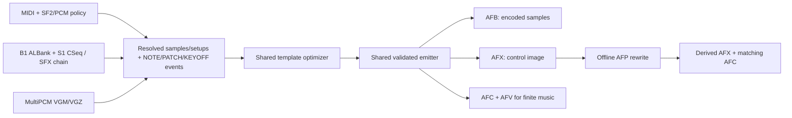

# Authoring

The supported offline authoring tools are native C. Choose an importer for the
actual source: MIDI/SF2 or raw PCM, N64 CSeq/ALBank, or Sega MultiPCM VGM/VGZ.
All lower into the same AICA register/event representation and emit the same
bank-bound playback model. A game integration can separately group its SFX
with an [AFSFX residency map](specs/afsfx.md).

Mappings select source samples and their explicit AICA sample coding
(`pcm16`, `pcm8`, `adpcm`, or `auto`). A `.afp` performance profile is an offline-only description of
register-level changes and DSP use: it produces a new AFX but never changes NOTE or KEYOFF
timing. Use the music source for timing and use `.afp` for timbre,
articulation and room treatment. The exact file roles and binary layouts are in
[Assets and sidecars](specs/assets.md); this guide is the human workflow for
creating them.

## What to edit

| Desired change | Edit |
| --- | --- |
| Score, rhythm, NOTE/KEYOFF placement | MIDI or the original sequence source |
| Source SoundFont, preset, sample quality/rate, loop trimming, SF2 lowering | AFBM |
| Shared/per-note AICA timbre, sustained PATCH expression, DSP send or overall pace | AFP |
| Which game SFX banks are preloaded together | Application AFSFX map |
| Runtime interaction (engine pitch, position, intensity, STOP) | SH4 code |

Generated AFB/AFX/AFC/AFV/AFI files are outputs, not the editable source of
truth. Keep the map/profile and pinned source inputs reproducible. Changing
the bank invalidates old bank bindings; changing an AFX invalidates its old
AFC and the AFP hash bound to it. Rebuild rather than patching header hashes.



AFP reuses the AFB unchanged. AFI catalogs are additional outputs of map-based
`afx_bank` builds; not every importer produces them. Controlled SFX emit only
AFB/AFX, without song-only seek/visual sidecars.

## Single MIDI and raw PCM

`make compiler` builds the host tools. `afx_compile` reads the note and tempo subset of a
Standard MIDI file and emits strict AFB/AFX/AFC/AFV assets. For example:

```sh
make compiler
build/afx_compile song.mid song.afb song.afx
# Or use one raw, little-endian PCM16 source (root key 69):
build/afx_compile song.mid instrument.pcm song.afb song.afx
```

Every native importer follows one pipeline: source parsing produces an
unoptimized list of PCM zones plus `NOTE`, `PATCH`, and `KEYOFF` events; the
shared optimizer chooses reusable setup templates; the shared emitter writes
AFB/AFX and the applicable sidecars. Source parsers must not write AFX bytes
themselves. The optimizer saves repeated setup words, not sample quality or
musical detail: NOTE_PL and PATCH_LEVEL are compact encodings of the same
register operations.

The current PCM input is raw little-endian PCM16 at AICA's 44.1 kHz playback
rate and uses MIDI key 69 as its root. This short form is intentionally a
one-shot source. Use SF2/AFBM for the configurable sample-rate and instrument
policies below, and AFP for derived register articulation.

The C compiler also accepts a small text zone map for key-split instruments:

```text
# key_min key_max root_key loop_start loop_end format pcm_path
0 65 48 -1 -1 pcm8 bass.pcm
66 127 72 0 1023 auto lead_cycle.pcm
```

`-1 -1` means one-shot; other loop bounds are inclusive PCM frame indices.
Every MIDI note must match exactly one zone. The compiler emits one 32-byte
aligned AFB payload. It greedily shares same-sample setup templates and moves
only differing static register words onto the affected NOTE, so a zone split
does not automatically cost another 36-byte setup.

The AICA loop-end register reaches frame index 65,535, but that is not the
authoring limit: a one-shot reserves a 256-frame silent safety tail and is
therefore capped at 65,279 frames; a looped sample is capped at 65,500 frames
to retain rounding room around its inclusive loop end.

```sh
build/afx_compile song.mid --zones instrument.zones song.afb song.afx
```

## SoundFonts and bank maps

For SoundFont input, the reader uses each
note's MIDI bank/program to select SF2 preset and instrument zones. The
requested encoding is explicit; `auto` chooses the smallest format passing the
same deterministic quality gate as zone maps (and conservatively skips ADPCM
for looped sources), then uses the established PCM8 baseline. PCM16 remains
an explicit mapping choice when a source needs it:

```sh
build/afx_compile song.mid --sf2 auto GeneralUser.sf2 song.afb song.afx
```

The native reader lowers the common SF2 instrument controls offline: volume
attack/decay/sustain/release, initial attenuation, pan, optional source reverb
send, static filter and filter-envelope controls, plus the standard
velocity-to-level curve. They become ordinary AICA setup words and NOTE mix
values; neither the SH4 nor ARM7 parses SF2 data.

Several songs can share one AFB. An `.afbm` text map declares any number of
SoundFont sources, optionally selects `stereo`, `left`, or `right` from linked
stereo samples, and routes each MIDI bank/program pair to a source preset.
The stable map prefix is followed by named conversion options, so adding a
policy never changes the meaning of an old column. This also lets one song
combine several SoundFonts while runtime still sees exactly one bank:

```text
source gm        soundfonts/GeneralUser.sf2
source orchestra soundfonts/orchestra.sf2 stereo
map * 0 0  gm        0 0  auto rate=22050
map * 0 42 orchestra 0 42 pcm16 rate=44100 filter=static gain=fluidsynth2
song title_theme midi/title_theme.mid 1000 750
song field_theme midi/field_theme.mid
```

```sh
build/afx_bank library.afbm output music.afb
```

The result is one `music.afb`, plus `title_theme.afx/.afc/.afv` and
`field_theme.afx/.afc/.afv`. AFX remains sample-free; every flow is bound to
the generated bank identity at load time.
The builder also writes `music.afi` and `music.names.afi` for optional SH4
one-shot sample access. `--per-song library.afbm output` instead writes one
bank plus sidecars per song, useful when only one piece is resident and each
needs its own quality budget.

To create an editable initial map from MIDI program usage:

```sh
build/afx_bank --create-map library.afbm GeneralUser.sf2 \
  title_theme midi/title_theme.mid field_theme midi/field_theme.mid
```

This is a starting mapping, not an artistic choice of the best SoundFont or
codec. Review its `auto` choices and edit routes/settings before building.
Multiple `source` entries may refer to different SF2 libraries. **Current
AFBM sources are SF2 only**; standalone PCM is supported by `afx_compile`
and its low-level zone-map mode, not by an invented AFBM PCM directive.

The available per-map options are `rate=<hz>`, `filter_offset=<cents>`,
`filter=envelope|static|none`, `gain=standard|fluidsynth2`,
`gain_bias=<centibels>`, `envelope=sf2|fixed`,
`source_pan=apply|ignore`, `source_reverb=apply|ignore`, `dsp_send=<0..255>`,
`modulators=apply|ignore`,
`midi_channel=<0..15>`, `direct=<AICA-word>`, `lfo=<rate>,<pitch-depth>,<amplitude-depth>` and
`loop_ms=<20..2000>`. `dsp_send` and `source_reverb=apply` are mutually
exclusive. `modulators=apply` is the default: linear SF2 graph inputs are
sampled at NOTE-on and folded into that note's existing setup/NOTE data.
Curved and time-varying graph inputs remain deliberately unsupported rather
than being guessed; use an AFP lane when an authored AICA PATCH is wanted.
Defaults are SF2 envelope/filter, standard gain, source pan and modulators
applied, and source reverb ignored. The map, not an AFP, owns all of these
choices because they can change the bank payload or base setup.

`midi_channel` is an optional source selector, not an AICA output channel.
It is useful when a score reuses a MIDI program number for separate parts,
such as melodic strings and percussion. A channel-specific map wins over the
generic rule for the same song and program; a song-specific generic rule wins
over `*`.

The optional `humanize <song> <seed> <level-centibels>
<shorten-ms> <lfo-rate-steps>` may follow its `song` line in the AFBM. It is a
deterministic offline lowering step: it modifies NOTE level and KEYOFF timing,
but adds no SH4 or ARM7 feature. `lfo-rate-steps` must be `0`; rate variation
is not implemented. Put deliberate rhythmic edits in the MIDI source.

## Performance profiles

`build/afx_profile init` creates an editable JSON `.afp` file from an
already-built AFX and binds it to that exact file with SHA-256. It creates
compact defaults and empty template/override/lane collections, not an explicit
entry for every note. `inventory` separately lists stable
`{tick, ordinal, channel}` selectors and their source setups when needed.

```sh
build/afx_profile init song.afx song.afp room 112
build/afx_profile inventory song.afx
# edit song.afp offline
build/afx_profile apply song.afx song.afc song.afp song-performance.afx song-performance.afc
build/afx_compile --visual song-performance.afx song-performance.afv
build/afx_profile describe song.afx song.afp
```

Use `defaults` for all notes, `setup_templates` for all uses of one source
setup, and `overrides` only for selected exceptions. Resolution is base setup,
defaults, setup template, note template, then note parameters. A lane at offset
zero folds into NOTE; a positive offset creates PATCH on that running voice.
The same raw AICA word parameters apply at all levels. There is no need to
list every note merely to enable DSP. See the
[AFP reference](specs/assets.md#afp--performance-profile) for the complete
schema, selectors, precedence and validation.

The applier writes register choices into derived AFX, updates its identity and
regenerates a matching AFC. Currently a changed profile gets a valid initial
(tick-zero) checkpoint; SH4 seek replay reconstructs later positions from it,
so do not assume the original dense checkpoint spacing is retained. A dry
profile with no register changes copies AFX/AFC byte-for-byte. The AFB and its
AFI remain unchanged. Regenerate AFV from the derived AFX, as above, so visual
expression follows the actual emitted stream.

`describe` prints `preset default-send tempo_q8_8` for the build to place in
its player metadata. Presets are `dry`, `room`, `room_warm` and `room_large`.
The **preset name and tempo are not installed by loading the AFX**: the SH4
player must construct/install the DSP scene and call `afx_instance_tempo()`.
The derived AFX carries channel DSP-send words. AICA has one scene program,
not one DSP program per note. `tempo_q8_8=256` is authored speed; this optional
whole-flow scale does not move individual NOTE/KEYOFF positions in the file.

An old AFP intentionally fails its hash binding after the base AFX changes.
Inspect/recreate the profile against the new inventory rather than replacing
its hash blindly. The current `apply` CLI takes an AFX **and matching AFC**;
DKR's controlled SFX path has no AFC and is not this profile workflow.

The optional fourth `song` field reserves a release tail in milliseconds. It
keeps that AICA channel unavailable after its musical `KEYOFF`, so an SF2
release can fade naturally while a following note is scheduled onto another
channel. It is entirely offline: the emitted AFX still contains only ordinary
`NOTE` and `KEYOFF` commands.

## Direct N64 music and SFX

```sh
build/afx_n64 audio_control.bin audio_table.bin sequences.bin 7 song.afx
# Select another ALBank entry when the control file contains several:
build/afx_n64 audio_control.bin audio_table.bin sequences.bin 7 song.afx 1
build/afx_n64 --sfx sfx_control.bin sfx_table.bin 563 collect_item.afx
```

The music mode reads B1 ALBank + S1 CSeq directly, never through MIDI. It
lowers key/velocity splits, source envelopes, tuning, pan, VADPCM/RAW16 and
supported live CC7/CC10/CC91/pitch-bend changes to ordinary NOTE/PATCH/KEYOFF.
An infinite source loop is cut at its first boundary to produce a finite
audition flow. The optional last argument is a zero-based ALBank index.

SFX IDs are one-based raw ALInstrument roots, **not game `SOUND_*` enums**.
The current SFX chain interpretation follows DKR's ALBank/key-map policy.
Finite components receive KEYOFF; sustained source components use controlled
PARK so SH4 owns STOP. Sample looping alone does not decide lifetime. SFX
emit AFB/AFX, not song seek/visual sidecars. See
[SFX bank maps](specs/afsfx.md) for grouping and the logical/raw-ID distinction.

To share an already-authored bank across music or SFX flows:

```sh
mkdir -p controls
build/afx_bank --merge music.afb controls raw/sequence_*.afx
```

Each input AFX needs its sibling AFB; an optional sibling AFC is relocated
along with it. Merging preserves sample bytes, coding and playback parameters,
deduplicates equal samples and rewrites bindings. It does not re-encode for
`auto`, merge AFV playlists or emit AFI. Several outputs can then use one
resident music bank; scene-specific SFX banks use the same one-bank-per-flow
contract.

## MultiPCM VGM/VGZ

```sh
build/afx_vgm soundtrack.vgz track.afx
build/afx_vgm soundtrack.vgz track.afx --gain-db -6.4 --adpcm
```

This tool lowers Sega MultiPCM registers and source sample ROM data to the
same event pipeline and emits AFB/AFX/AFC/AFV. PCM8 is the default; `--adpcm`
explicitly selects encoding. Default gain is -6.4 dB. It is not a general VGM
chip emulator: YM2612, PSG and arbitrary chips are not supported by this tool.

## Known boundaries

- MIDI timing, running status, bank/program, note-off, sustain and all-notes-off
  are parsed offline. Controllers/pressure are captured at NOTE-on for SF2
  lowering; general sustained MIDI controller automation is not yet emitted
  as PATCH. AFP lanes can express deliberate sustained changes.
- SF2 supports static envelope/filter/pan/gain and supported linear modulator
  inputs sampled at NOTE-on. Curved/time-varying graphs are not a generic
  runtime modulator engine. `auto` is a deterministic signal-quality heuristic,
  not a guarantee that no human can hear the encoding difference.
- N64 CSeq and OoT AudioSeq are different languages. AudioSeq is research
  code, not another native CSeq mode. Other N64 SFX chain conventions need
  source-specific lowering; B1 alone does not guarantee DKR-compatible SFX.
- Memory and per-tick voice/register-work limits are enforced during authoring
  and runtime. A valid standalone asset can still fail to fit with other live
  banks or DSP reservations. See [Memory](memory.md) and [Testing](testing.md).

The public validator and shared emitter enforce the output contract described
in the [format reference](specs/assets.md).
